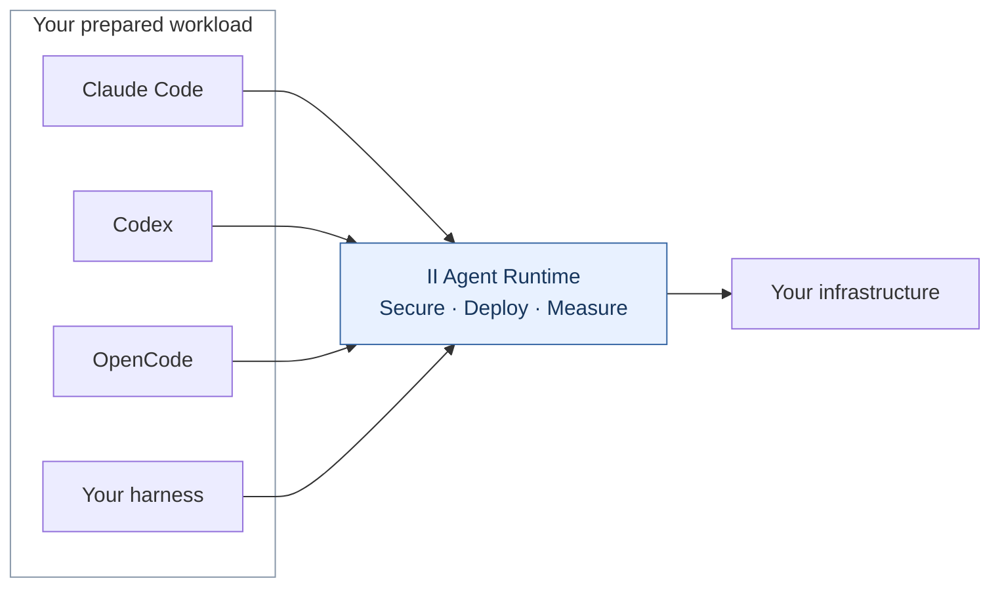
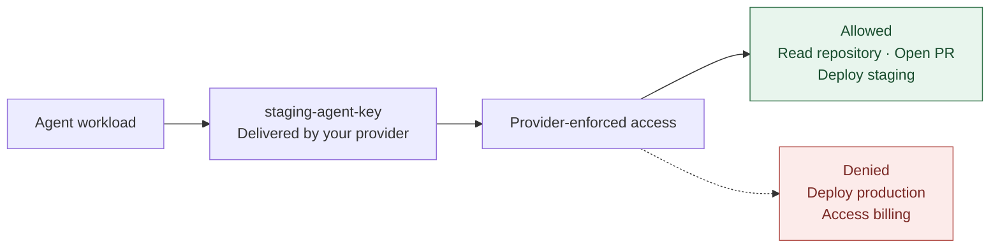
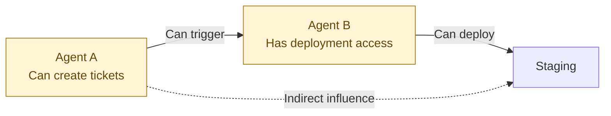
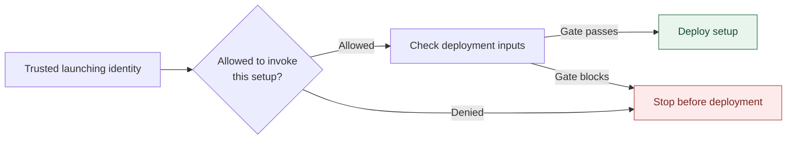
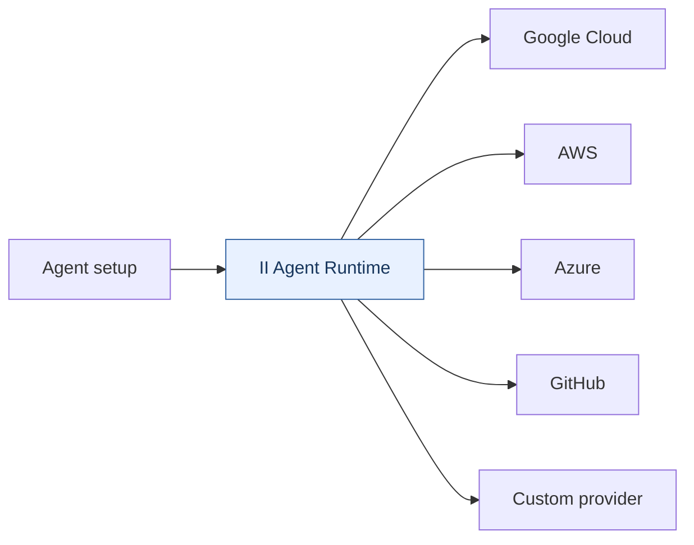
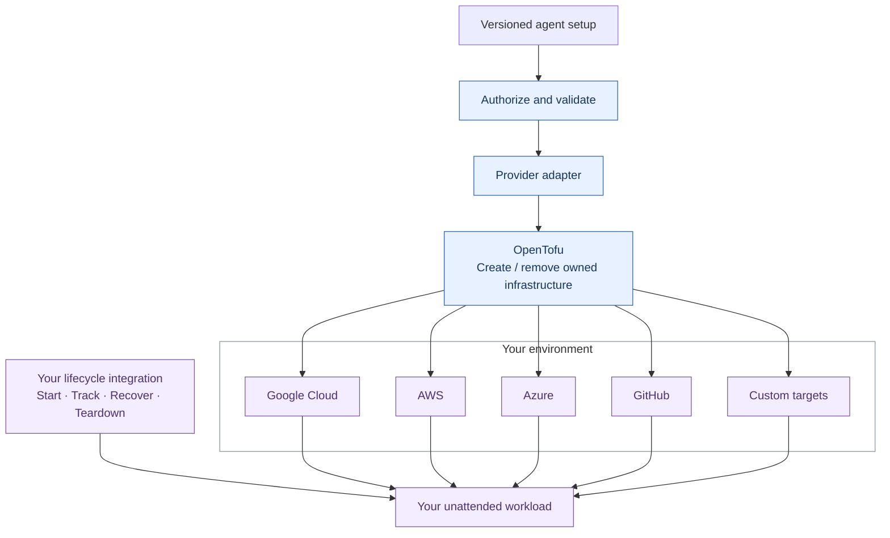
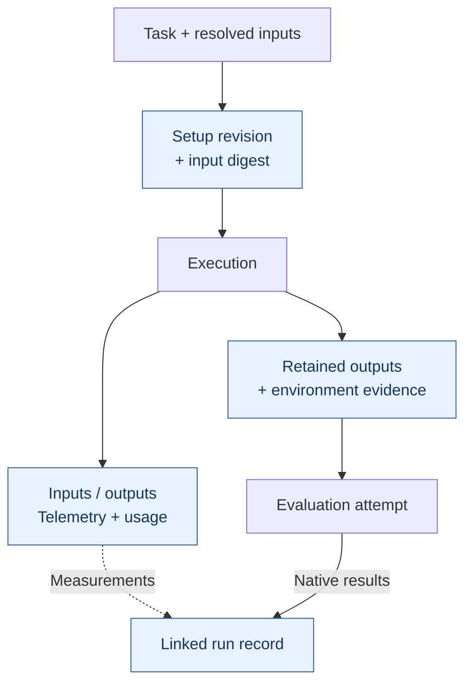
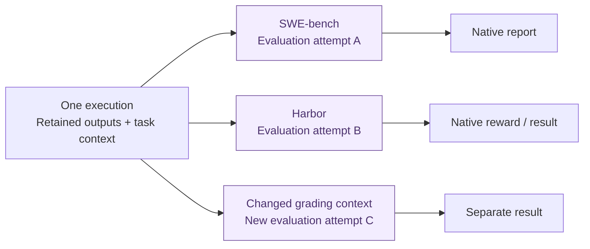
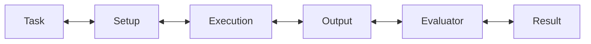

# II Agent Runtime 🫍

**Secure. Deploy. Measure.**

Open infrastructure for the agent harnesses your engineering team already uses.

Bring Claude Code, Codex, OpenCode, or your own harness. `II Agent Runtime` gives you reusable building blocks to configure what your agents can actually access, deploy versioned setups into your infrastructure, and capture the execution data you need to understand and evaluate what happened.

Use the TypeScript SDK, CLI, provider adapters, and local console as a starting point — then extend them for your environment.

You keep your harnesses, models, identities, credentials, compute, and telemetry storage.

`II Agent Runtime` gives you the infrastructure around them.

> **Status:** roadmap. We're designing and building this in the open. This repository currently contains the project overview, not a released runtime. The capabilities below describe the planned direction.

This README is the complete public documentation for `ii-agent-runtime`.

[Join our Discord](https://discord.gg/DEGQX9RVNn)

---

## Why does this exist?

More teams are being asked to put coding agents to work beyond a developer's laptop.

That creates a bunch of infrastructure work around the agent itself.

You need:
- to give agents real access without giving them everything.

- repeatable environments to run them in.

- to know who is allowed to launch those environments.

- retain what went into a run and what came out.

- telemetry when something goes wrong.

- evaluation when you want to know whether something can go right reliably.

This is the infrastructure you end up building **around** a coding agent.

That's what `II Agent Runtime` is for.

---

## Bring your harness



Supported harnesses have adapters out of the box.

If you have an internal harness or an integration we haven't built, the interfaces are intended to be extended.

---

## Secure

Don't rely on a prompt saying:

> "Only access staging. Don't touch production."

Give the agent credentials that **can access staging and cannot access production.**



`II Agent Runtime` gives you a way to configure and validate those boundaries as part of the agent setup.

An agent can be assigned the credentials and resources needed for its job — and nothing else.

The underlying provider still enforces the permission:

```text
GitHub
AWS
Google Cloud
Azure
internal APIs
...
```

`II Agent Runtime` gives you the layer for defining, checking, and gating with those permissions before the agent runs.

### Check indirect access too

With multiple agents, access can become less obvious.



Agent A may not hold the deployment credential itself, but it can influence something that does.

`II Agent Runtime` can model those configured relationships and surface circular or indirect permission paths that aren't obvious from looking at individual keys alone.

### Gate who can launch the setup

The other side of permissions is the invoker.

A powerful agent setup shouldn't be launchable by everyone just because its credentials are correctly scoped.



So security happens at two levels:

**What can this agent actually access?**

and

**Who is allowed to launch an agent with that access?**

No prompt-based security model required.

---

## Deploy

An agent is more than the harness binary you happen to run.

A useful setup can include its:

```text
harness
container
repository
environment
permissions
credential references
infrastructure
versions
telemetry configuration
evaluation context
```

`II Agent Runtime` treats those inputs as a **versioned deployment setup**.



The goal is a common deployment layer across the environments engineering teams already use.

Underneath, `II Agent Runtime` uses **OpenTofu** for reproducible infrastructure operations.



You keep control of the provider accounts, credentials, state, infrastructure and workload lifecycle.

`II Agent Runtime` gives you the reusable deployment contract and coordination around them.

### Version the whole setup

Find a setup that works?

Keep it.

```text
repo-fixer@12
```

Change the container, permissions, environment, harness configuration or infrastructure?

```text
repo-fixer@13
```

A new revision doesn't redefine what an old execution used.

That lets you answer:

**What exactly did we deploy?**

**Which permissions did it have?**

**Which environment produced this run?**

**Can we deploy that known setup again?**

This makes the **agent setup reproducible.**

---

## Measure

Then the agent actually does some work.

`II Agent Runtime` connects the run back to the evidence needed to understand it.



That gives you the raw material for:

**Debugging**

What exactly happened during this run?

**Analytics**

How are agents behaving across hundreds of runs?

**Comparison**

Did the new harness, model, prompt or environment actually change anything?

**Evaluation**

Did the resulting work pass the test that matters?

All of this can give you evidence for performance evaluations

---

## Evaluate what the agent produced

Execution and evaluation are separate.

That means one preserved run can be evaluated more than once.



Changing an evaluator doesn't rewrite the original execution.

We're building integrations around evaluation environments such as **SWE-bench** and **Harbor**, so execution records can feed their native grading flows instead of requiring another custom export pipeline.

You provide the task-specific pieces the evaluator requires.

`II Agent Runtime` connects:



---

## The pieces you shouldn't have to rebuild every time

`II Agent Runtime` is intended to give platform, AgentOps and developer-productivity engineers a useful starting point instead of another blank repository.

|                | `II Agent Runtime` provides                                                                               | You provide                                         |
| -------------- | ----------------------------------------------------------------------------------------- | --------------------------------------------------- |
| **Harness**    | Adapter contracts + supported integrations                                                | Claude Code, Codex, OpenCode or your own            |
| **Security**   | Credential/resource configuration, validation, relationship analysis and invocation gates | Provider IAM, identities and credential values      |
| **Deployment** | Versioned setups, provider adapters + OpenTofu coordination                               | Compute, provider access and workload lifecycle     |
| **Telemetry**  | Harness I/O correlation and execution records                                             | Storage, retention and environment-specific capture |
| **Evaluation** | Run/output/evaluator contracts + integrations                                             | Evaluators and task-specific grading inputs         |
| **Management** | TypeScript SDK, CLI and React console                                                     | The environment in which they run                   |

Use the pieces you need.

Extend the pieces specific to your organization.

Keep the underlying infrastructure yours.

---

## Deployment targets

The deployment layer is designed to grow across the places teams actually run and coordinate engineering workloads.

| Target                                 | Direction                             |
| -------------------------------------- | ------------------------------------- |
| **Local / containerized environments** | Core development path                 |
| **Google Cloud**                       | Initial cloud target                  |
| **AWS**                                | Planned provider support              |
| **Azure**                              | Planned provider support              |
| **GitHub**                             | Planned integration/deployment target |
| **Internal infrastructure**            | Custom adapters                       |

If your company has its own compute platform, sandbox service, runner system or deployment API, `II Agent Runtime` should be something you can extend — not something that forces you to replace it.

---

## The idea

You might be building this today:

```text
agents
  │
  ├── scoped credentials
  ├── permission validation
  ├── IAM mappings
  ├── containers
  ├── cloud deployment
  ├── setup versioning
  ├── telemetry
  ├── run records
  ├── artifact capture
  └── evaluation glue
```

A lot of that shouldn't need to be rebuilt independently at every company.

So we're building the reusable parts once.

**Secure. Deploy. Measure.**

---

## Contributing

Use this repository’s issues to discuss ideas and bugs, and pull requests to propose changes. Keep public documentation in this README and keep its links self-contained or pointed at public resources. Changes require review before merging.

## Security

Report suspected vulnerabilities privately through [GitHub private vulnerability reporting](https://github.com/intelligent-iterations/ii-agent-runtime/security/advisories/new). Do not include credentials or sensitive details in public issues or pull requests.
