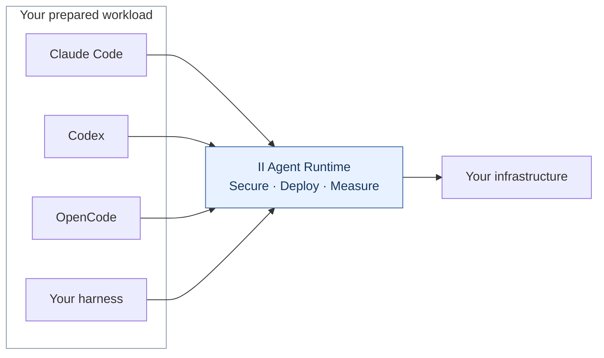
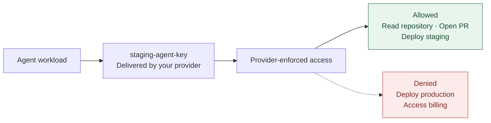
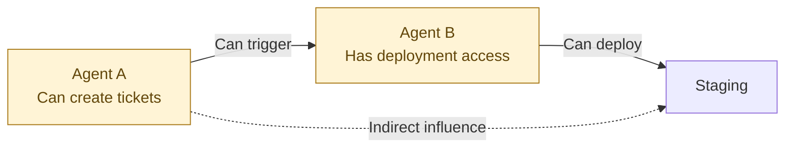
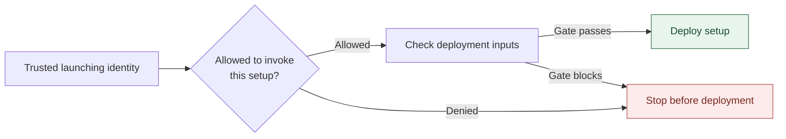
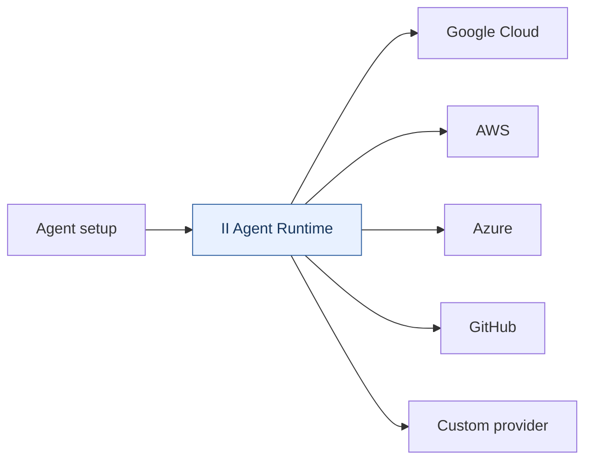
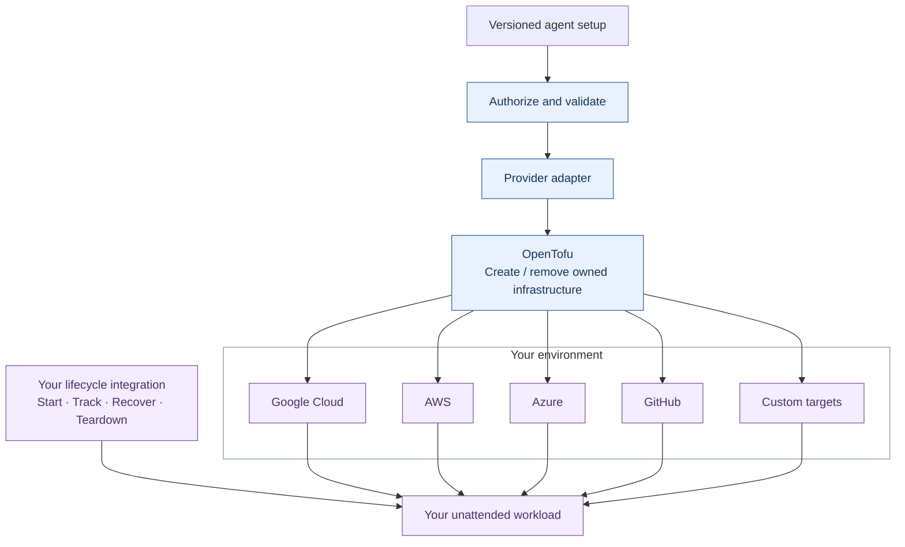
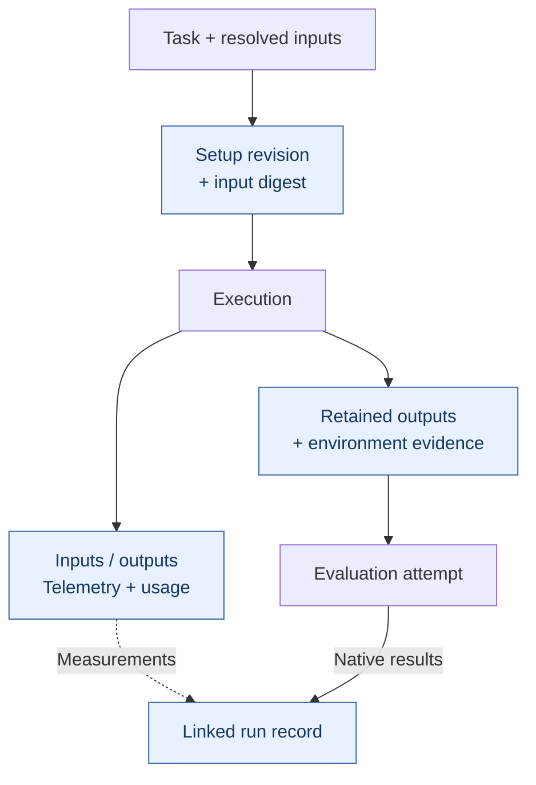
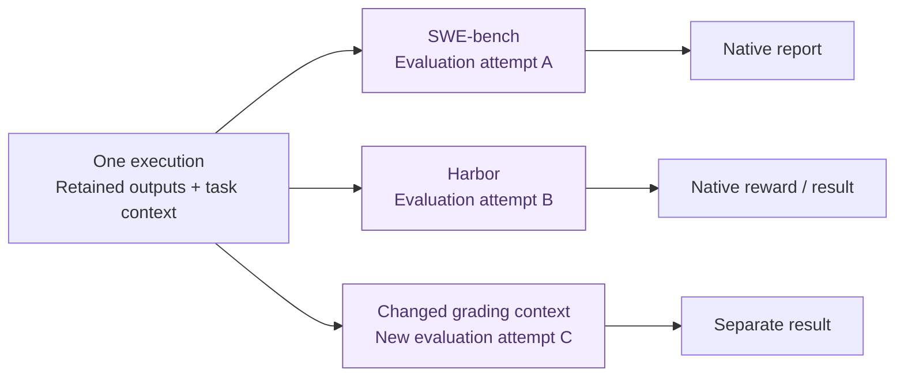
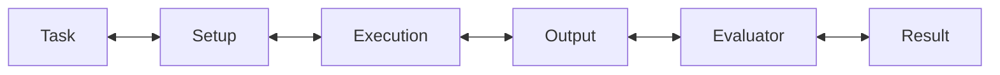

# II Agent Runtime 🫍

[](https://scorecard.dev/viewer/?uri=github.com/intelligent-iterations/ii-agent-runtime)

**Secure. Deploy. Measure.**

Open infrastructure for the agent harnesses your engineering team already uses.

Bring Claude Code, Codex, OpenCode, or your own harness. `II Agent Runtime` gives you reusable building blocks to configure what your agents can actually access, deploy versioned setups into your infrastructure, and capture the execution data you need to understand and evaluate what happened.

The implemented package is a TypeScript library. You supply the harness, models,
credentials, infrastructure, storage and workload lifecycle.

## Product direction

The sections below describe where we're going. See [what works today](#what-works-and-whats-next) for current support.

[Join our Discord](https://discord.gg/DEGQX9RVNn)

---

## Why does this exist?

More teams are being asked to put coding agents to work beyond a developer's laptop.

That creates a bunch of infrastructure work around the agent itself.

You need:
- to give agents real access without giving them everything.

- repeatable environments to run them in.

- to know who is allowed to launch those environments.

- retain what went into a run and what came out.

- telemetry when something goes wrong.

- evaluation when you want to know whether something can go right reliably.

This is the infrastructure you end up building **around** a coding agent.

That's what `II Agent Runtime` is for.

---

## Bring your harness


```mermaid
flowchart LR
  subgraph yours["Your prepared workload"]
    direction TB
    claude["Claude Code"]
    codex["Codex"]
    opencode["OpenCode"]
    custom["Your harness"]
  end
  runtime["II Agent Runtime<br/>Secure · Deploy · Measure"]
  infra["Your infrastructure"]
  claude & codex & opencode & custom --> runtime
  runtime --> infra
  classDef core fill:#e8f1ff,stroke:#3565a3,color:#17365d
  class runtime core
  style yours fill:transparent,stroke:#8796a8
```

The intended distribution will include adapters for supported harnesses. Today,
the package adapts Codex transcript events and executes caller-prepared commands.

If you have an internal harness or an integration we haven't built, the interfaces are intended to be extended.

---

## Secure

Don't rely on a prompt saying:

> "Only access staging. Don't touch production."

Give the agent credentials that **can access staging and cannot access production.**


```mermaid
flowchart LR
  agent["Agent workload"] --> key["staging-agent-key<br/>Delivered by your provider"]
  key --> policy["Provider-enforced access"]
  policy --> allowed["Allowed<br/>Read repository · Open PR<br/>Deploy staging"]
  policy -.-> denied["Denied<br/>Deploy production<br/>Access billing"]
  classDef allow fill:#e8f5ed,stroke:#34734b,color:#194d2e
  classDef deny fill:#fcebea,stroke:#b34f49,color:#7a2824
  class allowed allow
  class denied deny
```

`II Agent Runtime` gives you a way to configure and validate those boundaries as part of the agent setup.

An agent can be assigned the credentials and resources needed for its job - and nothing else.

The underlying provider still enforces the permission:

```text
GitHub
AWS
Google Cloud
Azure
internal APIs
...
```

`II Agent Runtime` gives you the layer for defining, checking, and gating with those permissions before the agent runs.

### Check indirect access too

With multiple agents, access can become less obvious.


```mermaid
flowchart LR
  a["Agent A<br/>Can create tickets"] -->|Can trigger| b["Agent B<br/>Has deployment access"]
  b -->|Can deploy| staging["Staging"]
  a -.->|Indirect influence| staging
  classDef indirect fill:#fff4d6,stroke:#a87918,color:#63470b
  class a,b indirect
```

Agent A may not hold the deployment credential itself, but it can influence something that does.

The planned permission analysis will model these relationships and surface
circular or indirect paths. Its rule semantics and evaluator remain undecided.

### Gate who can launch the setup

The other side of permissions is the invoker.

A powerful agent setup shouldn't be launchable by everyone just because its credentials are correctly scoped.


```mermaid
flowchart LR
  caller["Trusted launching identity"] --> guard{"Allowed to invoke<br/>this setup?"}
  guard -->|Allowed| check["Check deployment inputs"]
  check -->|Gate passes| deploy["Deploy setup"]
  check -->|Gate blocks| stop["Stop before deployment"]
  guard -->|Denied| stop
  classDef allow fill:#e8f5ed,stroke:#34734b,color:#194d2e
  classDef deny fill:#fcebea,stroke:#b34f49,color:#7a2824
  class deploy allow
  class stop deny
```

So security happens at two levels:

**What can this agent actually access?**

and

**Who is allowed to launch an agent with that access?**

No prompt-based security model required.

---

## Deploy

An agent is more than the harness binary you happen to run.

A useful setup can include its:

```text
harness
container
repository
environment
permissions
credential references
infrastructure
versions
telemetry configuration
evaluation context
```

`II Agent Runtime` treats those inputs as a **versioned deployment setup**.


```mermaid
flowchart LR
  setup["Agent setup"] --> runtime["II Agent Runtime"]
  runtime --> gcp["Google Cloud"]
  runtime --> aws["AWS"]
  runtime --> azure["Azure"]
  runtime --> github["GitHub"]
  runtime --> custom["Custom provider"]
  classDef core fill:#e8f1ff,stroke:#3565a3,color:#17365d
  class runtime core
```

The goal is a common deployment layer across the environments engineering teams already use.

Underneath, `II Agent Runtime` uses **OpenTofu** for reproducible infrastructure operations.


```mermaid
flowchart TB
  setup["Versioned agent setup"] --> checks["Authorize and validate"]
  checks --> adapter["Provider adapter"]
  adapter --> tofu["OpenTofu<br/>Create / remove owned infrastructure"]
  subgraph targets["Your environment"]
    gcp["Google Cloud"]
    aws["AWS"]
    azure["Azure"]
    github["GitHub"]
    custom["Custom targets"]
  end
  tofu --> gcp & aws & azure & github & custom
  owner["Your lifecycle integration<br/>Start · Track · Recover · Teardown"] --> workload["Your unattended workload"]
  gcp & aws & azure & github & custom --> workload
  classDef core fill:#e8f1ff,stroke:#3565a3,color:#17365d
  classDef consumer fill:#f3edff,stroke:#7958a1,color:#4c326e
  class checks,adapter,tofu core
  class gcp,aws,azure,github,custom,owner,workload consumer
  style targets fill:transparent,stroke:#8796a8
```

You keep control of the provider accounts, credentials, state, infrastructure and workload lifecycle.

`II Agent Runtime` gives you the reusable deployment contract and coordination around them.

### Version the whole setup

Find a setup that works?

Keep it.

```text
repo-fixer@12
```

Change the container, permissions, environment, harness configuration or infrastructure?

```text
repo-fixer@13
```

A new revision doesn't redefine what an old execution used.

That lets you answer:

**What exactly did we deploy?**

**Which permissions did it have?**

**Which environment produced this run?**

**Can we deploy that known setup again?**

This makes the **agent setup reproducible.**

---

## Measure

Then the agent actually does some work.

`II Agent Runtime` connects the run back to the evidence needed to understand it.


```mermaid
flowchart TB
  inputs["Task + resolved inputs"] --> revision["Setup revision<br/>+ input digest"]
  revision --> run["Execution"]
  run --> telemetry["Inputs / outputs<br/>Telemetry + usage"]
  run --> artifacts["Retained outputs<br/>+ environment evidence"]
  artifacts --> evaluation["Evaluation attempt"]
  telemetry -.->|Measurements| record["Linked run record"]
  evaluation -->|Native results| record
  classDef evidence fill:#e8f1ff,stroke:#3565a3,color:#17365d
  class revision,telemetry,artifacts,record evidence
```

That gives you the raw material for:

**Debugging**

What exactly happened during this run?

**Analytics**

How are agents behaving across hundreds of runs?

**Comparison**

Did the new harness, model, prompt or environment actually change anything?

**Evaluation**

Did the resulting work pass the test that matters?

All of this can give you evidence for performance evaluations

---

## Evaluate what the agent produced

Execution and evaluation are separate.

That means one preserved run can be evaluated more than once.


```mermaid
flowchart LR
  run["One execution<br/>Retained outputs + task context"]
  run --> a["SWE-bench<br/>Evaluation attempt A"]
  run --> b["Harbor<br/>Evaluation attempt B"]
  run --> c["Changed grading context<br/>New evaluation attempt C"]
  a --> ra["Native report"]
  b --> rb["Native reward / result"]
  c --> rc["Separate result"]
  classDef attempt fill:#f3edff,stroke:#7958a1,color:#4c326e
  class a,b,c attempt
```

Changing an evaluator doesn't rewrite the original execution.

We're building integrations around evaluation environments such as **SWE-bench** and **Harbor**, so execution records can feed their native grading flows instead of requiring another custom export pipeline.

You provide the task-specific pieces the evaluator requires.

`II Agent Runtime` connects:


```mermaid
flowchart LR
  task["Task"] <--> setup["Setup"]
  setup <--> execution["Execution"]
  execution <--> output["Output"]
  output <--> evaluator["Evaluator"]
  evaluator <--> result["Result"]
```

---

## The pieces you shouldn't have to rebuild every time

`II Agent Runtime` is intended to give platform, AgentOps and developer-productivity engineers a useful starting point instead of another blank repository.

|                | `II Agent Runtime` provides                                                                               | You provide                                         |
| -------------- | ----------------------------------------------------------------------------------------- | --------------------------------------------------- |
| **Harness**    | Adapter contracts + supported integrations                                                | Claude Code, Codex, OpenCode or your own            |
| **Security**   | Credential/resource configuration, validation, relationship analysis and invocation gates | Provider IAM, identities and credential values      |
| **Deployment** | Versioned setups, provider adapters + OpenTofu coordination                               | Compute, provider access and workload lifecycle     |
| **Telemetry**  | Harness I/O correlation and execution records                                             | Storage, retention and environment-specific capture |
| **Evaluation** | Run/output/evaluator contracts + integrations                                             | Evaluators and task-specific grading inputs         |
| **Management** | TypeScript SDK, CLI and React console                                                     | The environment in which they run                   |

Use the pieces you need.

Extend the pieces specific to your organization.

Keep the underlying infrastructure yours.

---

## Deployment targets

The deployment layer is designed to grow across the places teams actually run and coordinate engineering workloads.

| Target                                 | Direction                             |
| -------------------------------------- | ------------------------------------- |
| **Local / containerized environments** | Core development path                 |
| **Google Cloud**                       | Initial cloud target                  |
| **AWS**                                | Planned provider support              |
| **Azure**                              | Planned provider support              |
| **GitHub**                             | Hardened containers on GitHub-hosted runners, scoped App tokens, issue intake and pull requests implemented |
| **Internal infrastructure**            | Custom adapters                       |

If your company has its own compute platform, sandbox service, runner system or deployment API, `II Agent Runtime` should be something you can extend - not something that forces you to replace it.

### One pipeline, adapters chosen by configuration

Consumers describe what to run. The configuration decides where it runs and against which code host; the consumer decides how tasks arrive. A consumer launches every agent through one call:

```ts
import { createPipeline } from '@intelligent-iterations/ii-agent-runtime/pipeline';

const { report } = await createPipeline(compiled, { trigger, consumer, secrets, host }).run({ onEvent, describeChange });
```

Every pipeline runs the same stages: authorize, admit, provision, check out, set up, grant, isolate, confirm, execute, verify and deliver. Each stage goes through a port (`src/pipeline/ports.ts`). The stages and the ports name no provider, and a check refuses any import of an adapter into them; the composition root (`src/pipeline/create-pipeline.ts`) is the only place that picks one:

| Port | Chosen by | Adapters today |
| --- | --- | --- |
| `ExecutionTarget`: where the agent runs | `environment.provider` | `docker`: a hardened container created with OpenTofu; experimental `openshell`: a pinned OpenShell 0.1.2 sandbox |
| `SourceHost`: where the code lives | `source.provider` | `github`: a GitHub App installation on an organization or a user, with repository-scoped tokens, push verification and pull requests |
| `Intake`: where the task came from | `trigger.kind` | `github-issue`: an issue that names the repository to change, with the accepted issue actions and start limits chosen by the consumer. `custom`: the consumer's own intake, such as a chat message or a command line |
| `Harness` and `ModelProvider` | `harness.name` | `codex`: Codex with OpenAI's Responses API |

Configuration (`schemas/runtime-configuration.json`) holds no secrets and nothing specific to one consumer: keys are passed when the pipeline starts, and each consumer keeps its own settings in its own files. The runtime names none of its consumers either. Each one passes its `consumer` identity, for example `{ name: 'sample-app', displayName: 'Sample App' }`, and every durable name is derived from it: its task branches, its commit author, and the records an adapter keeps, such as the GitHub adapters' workflow path and admission ledger.

A value with no adapter, such as `environment.provider: aws`, is refused with `UnsupportedPipelineTarget`. Nothing falls back to another provider. Today each setting has one adapter; a new one is added behind the same ports, in the composition root, and callers do not change. A consumer that composes its own adapters can call `runPipeline` with its own ports.

---

## The idea

You might be building this today:

```text
agents
  │
  ├── scoped credentials
  ├── permission validation
  ├── IAM mappings
  ├── containers
  ├── cloud deployment
  ├── setup versioning
  ├── telemetry
  ├── run records
  ├── artifact capture
  └── evaluation glue
```

A lot of that shouldn't need to be rebuilt independently at every company.

So we're building the reusable parts once.

**Secure. Deploy. Measure.**

---

## What works and what's next

| Works today | What's next |
| --- | --- |
| One pipeline API (`createPipeline`): the execution target, code host and harness are chosen in configuration, and the trigger by the consumer | A second adapter for each port |
| Execution targets: hardened Docker containers and experimental OpenShell 0.1.2 on Linux, including GitHub-hosted runners | VMs; AWS, Google Cloud and internal platforms |
| Harness: Codex with OpenAI models, behind a gateway that enforces request, token and spend limits | Claude Code and other harnesses |
| Code host: GitHub, with short-lived tokens scoped to one repository, push verification and pull requests | Other code hosts |
| Triggers: GitHub issues, or any intake the consumer supplies | Built-in Jira, Linear and Slack intakes |
| Isolated workers: the network reaches only the gateway, and keys never enter the worker | Custom images per workload |
| Dependency setup before the agent starts, with no keys present | Setup limited to package registries |
| Launch checks: who may launch, concurrency and run limits, per-run and monthly budgets reserved before any spend | Return unused reservations; cost reporting |
| Versioned configuration in JSON, YAML or TypeScript, validated and pinned by digest | Saved configuration versions and run history |

The [Software Factory example](example/software-factory/) builds on the runtime: an organization files issues in one private repository, and agents open pull requests in its other repositories.

### Verification

The runtime passes its 62 tests. The Software Factory example passes its own 49
tests and a package contract test, reaching the runtime only through its package. On 2026-10-01 the example ran end to end on GitHub: the pipeline checked
out a test React site, installed its dependencies with `npm ci`, ran Codex in an
isolated worker that built the site successfully, verified the push and opened
the pull request. A clean machine and a second organization have not been tested yet.

[Package exports](src/index.ts)

## Example: software factory

`example/software-factory` is a reference
implementation built with II Agent Runtime. Its setup wizard gives an organization
a private hub repository and a GitHub App. People file issues in the hub, and
agents run in hardened containers on GitHub-hosted runners and open pull requests
in the organization's other repositories.

The example includes a worker image recipe, agent configuration and result
verification. Use it as a starting point, adapt its defaults, or build your own
application with the runtime's pipeline, permission and telemetry tools.

## Source layout

- `src/pipeline/`: provider-neutral orchestration and contracts.
- `src/runtime/`: configuration, authorization, admission and budgets.
- `src/providers/execution/`: Docker and OpenShell targets and shared execution operations.
- `src/providers/source/github/`: GitHub access and issue intake.
- `src/providers/harness/codex/`: Codex worker execution.
- `src/providers/model/openai/`: model gateway and usage accounting.
- `src/providers/gateway/`: worker-facing request mediation.
- `src/providers/shared/`: trusted process utilities used across adapters.
- `test/`: matching runtime, pipeline and provider groups; `npm test` discovers all `*.test.ts` files recursively. Live checks remain in `test/live/`.
- `example/software-factory/`: the consumer example and its own tests.

## Contributing

Use this repository's issues to discuss ideas and bugs, and pull requests to propose changes. Keep public documentation in this README and keep its links self-contained or pointed at public resources. Changes require review before merging.

## Security

Report suspected vulnerabilities privately through [GitHub private vulnerability reporting](https://github.com/intelligent-iterations/ii-agent-runtime/security/advisories/new). Do not include credentials or sensitive details in public issues or pull requests.

## License

Licensed under the [Apache License, Version 2.0](LICENSE).
Copyright 2026 Intelligent Iterations.
