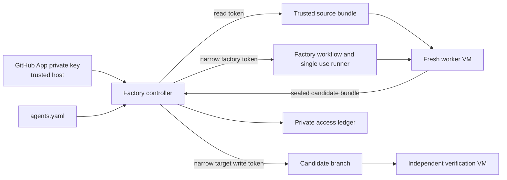

# Software factory architecture

| Term | Meaning |
| --- | --- |
| App | The factory's GitHub identity. One App is installed on the factory and approved target repositories. |
| Installation | An account administrator's grant of selected repositories and permission ceilings to the App. |
| Private key | Host held signing secret used to request App installation tokens. It never enters a VM or OpenTofu state. |
| Installation token | Short lived credential narrowed to explicit repository IDs and permissions for one operation or agent attempt. |

The App installation is an upper bound. A holder of its private key can request any access within that bound. The factory reads its own installation webhook deliveries, validates its local policy, and checks the live installation ID, update time, repository selection, and returned token scope before use. Installation changes still require administrator review. Local policy and token metadata cannot prove what happened during a provider outage; stale observations are marked unknown.

`agents.yaml` binds each task to a repository, exact base commit, VM profile, and optional `githubPermissions`. The default agent has no GitHub token. The factory stores task and resource checkpoints in private SQLite state. Ambiguous dispatch or push results are reconciled against GitHub rather than repeated blindly. The worker VM and single use runner are removed before the separate verification VM runs.

The access ledger records recipient, resource, requested and observed capabilities, actor fields, policy revision, issue and expiry times, and revocation or uncertainty events. It never stores credential values. `ii-factory access list` and `access history` show current assessments and event history. OpenTofu retains its infrastructure role; it does not record minted tokens.

The root runtime owns generic setup, runner, Tart, and OpenTofu primitives. This example owns GitHub App policy, token issuance, YAML, job state, candidate publication, and acceptance. GitHub Actions uses self hosted runners and on prem retention; it has no artifact upload or dependency cache.
